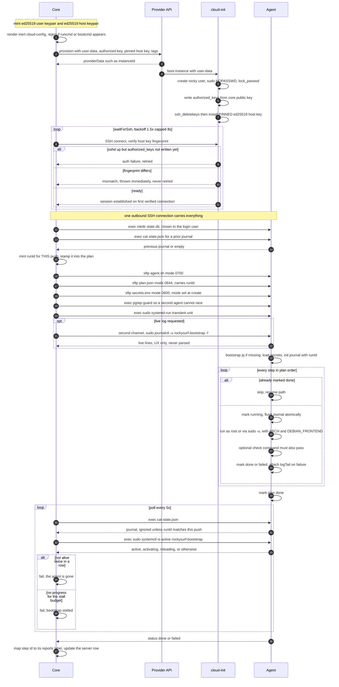
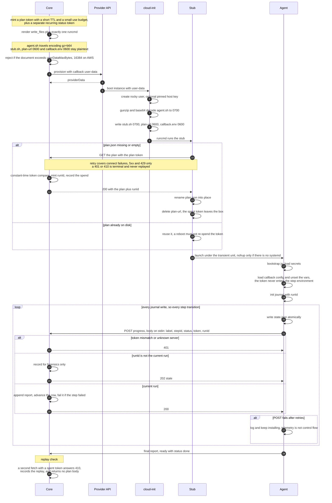

# The bootstrap contract

**Status: normative for v0.1.** This document defines the wire formats and behavioural
guarantees between three parties — the control plane ("core"), the on-box agent, and the
pre-boot configuration that connects them. It is the machine-facing counterpart to
[`writing-a-pack.md`](writing-a-pack.md), which is the author-facing one: that page tells a
human what their script must do, this page tells an implementer what the system promises.

Every normative statement here is grounded in
[ADR-0002](adr/0002-push-bootstrap-default-callback-fallback.md) and in the evidence behind it,
[`spike/findings.md`](spike/findings.md). Amendment ids (`E1`, `E5`…) and finding numbers
(`#39`, `#44`…) refer to that memo. Where this document adds a rule the memo did not state, it
says so explicitly.

**MUST**, **MUST NOT**, **SHOULD** and **MAY** are used in the RFC 2119 sense.

## Contents

- [The two modes](#the-two-modes)
- [InstallPlan](#installplan)
- [state.json](#statejson)
- [Step idempotency](#step-idempotency)
- [What the agent may assume](#what-the-agent-may-assume)
- [Push mode](#push-mode)
- [Callback mode](#callback-mode)
- [The systemd unit contract](#the-systemd-unit-contract)
- [Security invariants](#security-invariants)
- [Failure semantics](#failure-semantics)
- [Conformance checklist](#conformance-checklist)

---

## The two modes

Both modes execute **the same plan** with **the same agent**. They differ only in who moves the
bytes.

| | push (default) | callback (scoped fallback) |
|---|---|---|
| Pre-boot config | inert `#cloud-config`, ~2.1KB, constant | carries the agent + a `runcmd`, 11,752B measured on AWS |
| Who delivers the agent | core, over SSH | user-data, `gz+b64` |
| Who fetches the plan | nobody — core pushes it | the box, with a plan token |
| Who moves progress | core polls `state.json` | the box POSTs |
| Core reachable from box | not required | **required** |
| Credential left on box | none | the status token, for the whole bootstrap |

Push is the default and the only topology that requires nothing inbound (ADR-0002 Decision 1,
amendment `E1`). Callback is supported **only for deployments where core is already publicly
reachable — a hosted control plane** (Decision 2). It MUST NOT be presented to self-hosted users
as the answer to an unreachable box: the real-cloud run that proved callback works
(`rockysurf-q5lm.5`) needed core to open an SSH reverse tunnel *into the box* to make it work at
all, which is precisely the connectivity push already has. **Callback earns its keep only where
core is already publicly reachable.**

Implementations MUST NOT fork the executor. One plan, one agent, one journal; the callback
branch stays inert unless its configuration file exists (Decision 3).

---

## InstallPlan

Core renders a plan, snapshots it, and hands it to the box. The plan is **data**: the agent
never resolves a pack, queries a database, or talks to a cloud API.

### Schema

```jsonc
{
  "version": 1,                    // frozen for v0.1; reject anything else
  "serverId": "srv_5c1157422892",  // core's id for this server
  "mode": "push",                  // "push" | "callback"
  "runId": "c4bbcc78-…",           // identity of THIS bootstrap attempt; see state.json
  "callbackUrl": "https://core.example/internal/servers/srv_…/status",  // callback mode only
  "steps": [
    {
      "id": "tool:claude-code",    // unique within the plan; the journal's key
      "reports": "installing_tools", // the label core displays; several steps may share one
      "runAs": "rocky",            // "root" | "rocky"
      "run": "set -euo pipefail\nnpm install -g …",
      "check": "claude --version", // optional; must exit 0 for the step to count as done
      "optional": false,           // optional; a failed optional step does not stop the plan
      "timeoutSeconds": 900        // optional; 0 or absent means no timeout
    }
  ]
}
```

Field rules:

- `id` MUST be unique within the plan and stable across re-renders of the same logical plan.
  It is the key the journal resumes on, so an id that changes between renders silently re-runs
  work. Use the namespaced forms below.
- `reports` is core's vocabulary, not the agent's, and it is **lossy on purpose** — several
  steps legitimately share one label. Core MUST NOT infer which step finished from `reports`
  alone; that is what `id` is for (finding: `step` alone is lossy, ADR-0002 Decision 7's
  neighbourhood).
- `run` MUST be executed by `bash`. Steps SHOULD begin `set -euo pipefail`; the agent isolates
  and records a failing step, but only if the step reports failure.
- `check`, when present, runs as the same `runAs` after `run` succeeds. A step is `done` only
  when both exit 0. Without this, an installer that exits 0 after a partial install is reported
  as working software.
- `timeoutSeconds` is enforced with `timeout(1)` when available.

### Step ordering

The plan is a **flat, fully ordered list**. The agent walks it top to bottom and applies no
ordering logic of its own. Core MUST render steps in exactly this sequence:

| # | Phase | Step id form | Notes |
|---|---|---|---|
| 1 | Runtime-guaranteed base tools | `tool:<toolId>` | `bootstrap: true` tools; reserved for the runtime |
| 2 | Pack tools, ascending `installOrder` | `tool:<toolId>` | The band convention (base 10–30, agents 40) puts base tools before agents; that is a consequence of the numbers, not a second rule |
| 3 | Repository clones | `repo:<basename>` | One step per repository the user chose |
| 4 | `setupScript`s, same order as phase 2 | `tool-setup:<toolId>` | After clones, because a setup script may read `$REPOS`. The step body opens with a preamble that exports `$REPOS`, sets `GIT_TERMINAL_PROMPT=0`, and — under the clone step's own guard, when the box carries any token — wires the clone step's credential helper into git's `GIT_CONFIG_COUNT`/`GIT_CONFIG_KEY_n`/`GIT_CONFIG_VALUE_n` environment, so a git run by the script or by any program it starts authenticates the way the clone did (issue #142: `gt rig add` re-clones the repository itself and had no credentials). The environment dies with the step; nothing is written to any git config |
| 5 | Branding | `branding` | The `/etc/motd` welcome banner and `/etc/rockysurf/server-info`; also quiets Ubuntu's stock MOTD scripts. Optional, and omitted entirely when the caller sets `branding: false` |
| 6 | Remote desktop password | `rdp` | Only when the pack sets `requiresRdp` |
| 7 | Retire core's own key | `supplied-key-only` | Only when the row carries a supplied public key ([ADR-0008](adr/0008-supplied-key-retires-managed-key.md), issue #92). LAST, after every step that needs SSH — removing the `authorized_keys` LINE mid-session does not close the SSH session already carrying this drive. REQUIRED, not optional: a failed guard fails the whole plan rather than silently leaving both keys. |

**Ties MUST be broken deterministically.** Two tools with equal `installOrder` are ordered by
`toolId` ascending. A *rendered plan* cannot be non-deterministic: two renders of the same pack
would otherwise produce two different step orders, and resume across a re-render would skip the
wrong work. Determinism here is what makes the journal's ids meaningful.

This is an **executor guarantee, not a scheduling tool**, and the distinction matters to pack
authors: they must still express dependencies with distinct `installOrder` values and never lean
on the tie-break. [`writing-a-pack.md`](writing-a-pack.md#installorder-and-the-gaps-of-10-convention)
states the same rule in the author's direction, and is the place to look for the band
convention.

### Size

In callback mode the plan travels in the HTTP response, not in user-data, so it is not size
constrained. The **agent** is what user-data carries, and it MUST be compressed —
see [Security invariants](#security-invariants).

---

## state.json

`/var/lib/rockysurf/state.json` is the agent's journal and **the source of truth for bootstrap
progress in both modes**. In callback mode the POSTs are a copy in flight, never a substitute:
if they are all lost, the box still finishes and the journal still describes what happened.

```jsonc
{
  "planVersion": 1,
  "serverId": "srv_5c1157422892",
  "runId": "c4bbcc78-…",           // echoes the plan's runId
  "step": "tool:claude-code",      // the step most recently transitioned
  "status": "running",             // "running" | "done" | "failed"
  "updatedAt": "2026-08-12T02:48:47Z",
  "failedStep": "tool:node",       // present only when status is "failed"
  "logTail": "curl: (6) Could not resolve host…",  // last ~25 lines of the failing step
  "steps": [
    {
      "id": "tool:claude-code",
      "reports": "ready",
      "status": "done",            // "pending" | "running" | "done" | "failed"
      "startedAt": "2026-08-12T02:48:31Z",
      "finishedAt": "2026-08-12T02:48:47Z"
    },
    {
      "id": "repo:my-app",
      "reports": "cloning_repos",
      "status": "failed",          // an optional step that failed; the plan went on
      "startedAt": "2026-08-12T02:48:48Z",
      "finishedAt": "2026-08-12T02:48:50Z",
      "logTail": "fatal: repository 'https://…/my-app/' not found"  // last 60 lines of THIS step (ADR-0010)
    }
  ]
}
```

The per-step `logTail` is what lets an optional step's failure be explained after the plan has
moved on, and what callback mode — which has no channel for core to read the log file itself —
sends in its report. Push mode reads the whole step log over SSH and treats this as a fallback.

Requirements:

- The agent MUST write this file **atomically** — write a temporary file, then `rename(2)` it
  into place. Core reads it concurrently, and a torn read at exactly the wrong moment is
  otherwise indistinguishable from corruption.
- A reader MUST treat an absent, empty, or unparseable file as *no news yet*, not as failure.
- The agent MUST stamp `runId` before executing any step, and MUST carry it on every report.
- Core MUST ignore a journal whose `runId` is not the run it is waiting on. Without this, a push
  to an already-bootstrapped box reads the previous run's terminal status and reports success
  before the agent has started — and a retry of a *failed* bootstrap reports the old failure as
  the new result (ADR-0002 Decision 7, amendment `E6`). Reports from a superseded run SHOULD be
  retained for forensics but MUST NOT move the server's recorded progress.
- A push that finds the agent **already running for this server** MUST adopt the live run's id
  rather than minting a new one. The agent reads `runId` from `plan.json` once, at launch, so a
  fresh id would be stamped by nobody: core would discard every update as a foreign run and
  watch a healthy install in silence until its stall timeout. This is the ordinary case after a
  core restart. The rule above is unaffected — adoption requires the agent to be *alive* and its
  journal `running`, so a terminal journal from a previous attempt is still never adopted.

### Who starts a push

**The provision ticker, not the create path.** Core sweeps push-mode rows in `provisioning` and
starts a bootstrap for any that has no run in flight, which makes a newly created server and a
server left mid-install by a restart the same case, handled by the same code. A create path that
started its own push would need a second, separate trigger for recovery, and the two would drift.

A row therefore stays in `provisioning` until its own bootstrap reports `ready`. The provider
reporting `running` means the hypervisor has the machine; it does not mean the box is usable, and
core MUST NOT promote on it — doing so closes the window in which progress reports are accepted
and abandons the box mid-boot.

### The step state machine

```
pending ──▶ running ──▶ done
                  └───▶ failed ──▶ (plan stops, unless the step is optional)
```

**Only `done` is skipped on resume.** A step left `running` by a `SIGKILL`, a reboot, or a lost
connection re-runs from the top, because a journal entry is written when a step *finishes*.
That single rule is why the next section exists.

---

## Step idempotency

> **Every step MUST be safe to run more than once, and a second run MUST change nothing.**

This is the load-bearing requirement of the whole design: resume is what makes an interrupted
bootstrap recoverable, and resume re-runs any step that was interrupted mid-flight. A
non-idempotent step does not merely waste time — it corrupts a resumed box in ways that look
like a working install (a `PATH` line appended twice, a clone that aborts because the directory
exists, an installer that refuses to overwrite itself).

The authoring rules, worked examples, and the CI gate that enforces them live in
[`writing-a-pack.md` § Rule 1: Idempotent](writing-a-pack.md#rule-1-idempotent) and are **not
repeated here**. That page is the single source of truth for how to write a conforming step;
this page states only that the executor's guarantees depend on it. The two documents share one
rule, deliberately phrased once in each direction: authors are told *what to write*,
implementers are told *what they may rely on*.

CI runs every pack twice on both architectures, so idempotency is proven rather than promised
(ADR-0004).

**A second run only proves something if the journal is discarded first.** Any harness that
tests idempotency by re-invoking the agent MUST delete `state.json` between runs. Leave it in
place and the agent does exactly what this contract promises — reads the journal, skips every
completed step, exits 0 — and the gate passes without executing a single script body twice. The
journal exists to *prevent* re-execution; a test of re-execution has to take it away first. The
same applies to any local reproduction of the CI gate.

This is the one place where the executor's correct behaviour and the test's purpose point in
opposite directions, so it is stated in both documents: see
[`writing-a-pack.md` § The CI smoke test](writing-a-pack.md#the-ci-smoke-test) for the harness
side.

---

## What the agent may assume

**Nothing about the base image.** "Ubuntu 24.04" is not a contract about installed packages:
Hetzner's image ships without `jq` and Canonical's AWS AMI has it, so the agent's defensive
bootstrap path fired on exactly one cloud during the spike (ADR-0002 Decision 9, amendment
`E10`, finding `#36`).

Consequently the agent MUST:

- bootstrap its own JSON parser before parsing the plan, and MUST NOT assume `jq`, `curl`,
  `python3` or fresh apt lists exist;
- normalise architecture itself and export `ARCH` as `amd64` or `arm64` — Debian's spelling,
  not `uname`'s — so no step has to care which it reads;
- export `DEBIAN_FRONTEND=noninteractive` for every step;
- establish its own `HOME`, `USER` and `LOGNAME` — from the passwd entry of the user it runs
  as — before any step runs, because a root step inherits the agent's environment and the
  launcher may hand the agent none of them. The transient systemd unit does exactly that:
  systemd sets those three only for units with `User=`, and this one runs as root without it.
  A Docker `exec` and a `nohup` shell both carry a `HOME`, which is how an upstream installer
  piped to `bash` under `set -u` passed every harness and died on a real box with
  `HOME: unbound variable` (issue #158). The harness now starts the agent with all three
  unset so that this requirement is the one under test;
- dispatch privilege from the step's `runAs` before the script has any say: `root` directly,
  otherwise `sudo -u <user> -H env …`;
- capture stdout and stderr per step, and keep the tail of a failing step for `logTail`.

The environment guaranteed to a step is defined in
[`writing-a-pack.md` § The environment your script gets](writing-a-pack.md#the-environment-your-script-gets).
The agent MUST NOT export control-plane credentials into it — see
[Security invariants](#security-invariants).

Exit codes: `0` = plan complete; `1` = a required step failed; `2` = the agent could not start
(no plan, or no usable JSON parser).

---

## Push mode

Core connects outbound, delivers everything, and watches. Nothing listens for the box.



Normative points specific to push:

- Core MUST verify the host key on the **first** connection, against a key it minted before the
  server existed. There is deliberately no trust-on-first-use path: the first connection is the
  one carrying the secrets file.
- A host-key mismatch MUST NOT be retried. Early **authentication** failures MUST be retried —
  sshd accepts connections before cloud-init has written `authorized_keys`, so a healthy box
  legitimately refuses the first few attempts.
- File modes on delivery: `agent.sh` `0700`, `plan.json` `0644`, `secrets.env` `0600`, each set
  in the call that creates the file. A secrets file that is briefly world-readable before a
  `chmod` lands has already leaked.
- Core MUST guard against launching a second agent while one is running.
- The live log stream is opened only when a caller wants it, and degrades to tailing the
  agent's log file when the box has no systemd. It is UX; `state.json` is truth.

---

## Callback mode

The box fetches its own plan and reports inward. Core initiates nothing.



Normative points specific to callback:

- The plan fetch MUST happen at most once per box under normal operation: the stub fetches only
  when it has no plan on disk, so a reboot or a unit restart cannot re-spend the token.
- The fetch MUST retry only connection failures, 5xx and 429, and MUST NOT replay a 4xx.
  **Strict single-use and at-least-once delivery do not compose** — spend the token, lose the
  response, and the retry gets 410 with no way to ask again: one dropped packet, one dead box.
  Core therefore issues a plan token with a **short TTL and a small use budget** rather than a
  strictly single-use one (ADR-0002 Decision 6, amendment `E8`). Every use after the first MUST
  still be recorded, because a replay is the only signal core ever gets that user-data leaked.
- Progress is reported on **every journal write**, not once per step — a three-step plan produces
  seven reports (an initial one, then `running` and `done` per step). Consumers MUST treat the
  stream as append-only and idempotent rather than counting on one report per step.
- Reports MUST carry `stepId` as well as the display label, and MUST carry `runId`.
- Reports SHOULD carry `stepStatus` (the reported step's own outcome, distinct from the plan's
  `status`) and, when that step failed, its `logTail` (ADR-0010). Core builds the failure report
  from these; without them a callback-mode failure has no evidence and a failed optional step is
  invisible.
- A failed report MUST NOT stop the install. Progress is telemetry; the journal is the record.
- **Timing that makes this work:** sshd comes up in cloud-init's *init* stage while `runcmd` runs
  in the *final* stage. On the verified AWS run core had its ingress path open at 23.9s and the
  box's first report arrived at 25.9s. An implementation whose core must be reachable before
  `runcmd` fires SHOULD rely on the stub's retry budget rather than on that ordering holding.

---

## The systemd unit contract

The agent MUST outlive the session that launched it. A bare backgrounded process dies with the
SSH channel the moment core's laptop drops Wi-Fi mid-install.

Core launches the agent as a **transient unit**:

```
systemd-run --unit=rockysurf-bootstrap --collect \
  --property=Type=exec \
  --property=Restart=on-failure \
  --property=RestartSec=10 \
  --property=StartLimitBurst=3 \
  --property=StartLimitIntervalSec=600 \
  --property=After=network-online.target \
  /bin/bash /var/lib/rockysurf/agent.sh
```

Requirements:

- **Decoupled from the SSH session.** Closing the connection MUST NOT signal the agent.
- **`Restart=on-failure`** so a step that failed on a transient network error gets another
  attempt — bounded by `StartLimitBurst` so a genuinely broken plan does not loop forever.
  Restart is safe *only* because every step is idempotent and the journal skips completed work.
- **`After=network-online.target`**, so the agent does not begin before the box can reach a
  package mirror.
- **`--collect`** so the unit name is freed once it exits and the next bootstrap can reuse it.
  A leftover unit makes the "already running" guard lie.
- **No `User=`, and therefore no `HOME`, `USER` or `LOGNAME` from systemd.** The unit's
  environment is what systemd gives a root service: `PATH`, `LANG`, `INVOCATION_ID` and the
  like — not the login variables, which systemd sets only when `User=` is present. The agent
  establishes them itself (see [What the agent may assume](#what-the-agent-may-assume));
  nothing about this launch line is to be relied on for them, and a `--setenv=HOME=` here
  would fix one launcher while leaving the contract unstated for the other.
- Where there is no systemd, the launcher MUST fall back to a fully detached process
  (`setsid`, redirected stdio) and core MUST fall back to tailing the agent's log file. This
  path is verified only in containers; the transient unit is the real one and is verified on
  both clouds.

**Liveness MUST be checked through the launcher, not only through the journal.** A staleness
timeout cannot tell a slow `apt-get` from a SIGKILLed agent: any timeout long enough to avoid
false positives on the former is far too long to notice the latter. `systemctl is-active`
answers directly, and `activating` and `reloading` count as alive. Core SHOULD require two
consecutive negative answers before declaring the agent gone, because a just-launched unit can
lose the race to the first poll.

**Those queries MUST run through `sudo`.** Unprivileged `systemctl is-active` fails with
"Failed to connect to bus" whenever dbus is unreachable, which reads as *not running* to any
caller checking the exit code — that is how core declared a healthy bootstrap dead during the
spike (ADR-0002 Decision 8, amendment `E7`).

---

## Security invariants

These are requirements, not recommendations. Each was learned from something that went wrong.

1. **Control-plane credentials MUST NOT share a file with the environment exported to install
   steps.** The agent exports its secrets file into every unprivileged step's environment, which
   is correct for an API key the installed software needs and wrong for the token that
   authenticates core's control plane — no install script has any business seeing it. Two files,
   two lifetimes, one never exported (finding `#43`, amendment `E9`).
2. **Secrets MUST NOT appear in argv.** A token passed as a `curl -d` argument is readable via
   `ps` by every user on the box, including the unprivileged steps the agent is about to run.
   Pass bodies on stdin.
3. **Two tokens, two lifetimes** (amendment `E8`). The plan token ships in user-data, which every
   process on the box can read from the instance metadata service forever, so its exposure window
   MUST be short. The status token authenticates recurring POSTs and therefore cannot be
   single-use; its blast radius MUST stay bounded to writing progress strings on one server row.
   **No route that returns anything secret may accept the status token.**
4. **Every plan-token use after the first MUST be recorded.** It is the only evidence core ever
   gets that a box's user-data was read by someone else.
5. **Anything large in user-data MUST be compressed with cloud-init's native `gz+b64`, and the
   size check MUST stay in the renderer** (amendment `E5`, ADR-0002 Decision 5). This is measured,
   not hypothetical, and it is measured twice. Locally, a callback document with the agent
   embedded **verbatim** rendered **19,130 bytes against EC2's 16,384-byte ceiling** — a
   provider-side 400 at provision time, on AWS only, invisible to unit tests and to Hetzner's
   32KB limit. On real AWS, the shipped document — a 14,185-byte agent carried `gz+b64` —
   measured **11,752 bytes, 72% of the ceiling**, and real cloud-init decoded it back to core's
   exact bytes. (The two figures are separate measurements taken at different times, not a
   before-and-after on identical input: the agent grew between them. Read them as "verbatim does
   not fit" and "compressed fits, at 72%", not as a compression ratio.) Pair the renderer check
   with `validateSpec()` (amendment `A7`, ADR-0003) so the provider owns its own limit. A growing
   agent is a signal to move work out of user-data, not to raise the limit.
6. **Host keys MUST be minted by core and pinned via pre-boot config where the provider supports
   it**, so the first connection is verified rather than trusted. Where it is not supported, the
   fallback is trust-on-first-use and the interface MUST say so rather than leaving callers to
   discover it (amendment `E4`).
7. **The box MUST hold no cloud credentials and MUST NOT depend on the instance metadata
   service.** Nothing on the box is cloud-specific by design.

---

## Failure semantics

| Situation | Agent | Core |
|---|---|---|
| Required step fails | records `failed`, attaches `logTail` (plan-level and on the step), stops the plan, exits 1 | reads the step's whole log off the box (push) or takes the agent's tail (callback), builds the `BootstrapReport`, fails the server with the summary as its reason — and, for a `tool:*` step under `bootstrap.onFailure: terminate`, **releases the instance first** (ADR-0010) |
| Optional step fails | records `failed` with the step's own `logTail`, continues | records it as a **warning** on the row's report; the server is not failed and, if the plan completes, comes up `running` with the warning visible |
| Step fails with an apt fetch signature in its own output (`Failed to fetch`, `Unable to fetch some archives`, `Some index files failed to download`, `Mirror sync in progress`, `Hash Sum mismatch`) | **once per bootstrap**: rewrites any regional Ubuntu mirror in the apt sources (`*.archive.ubuntu.com`, `*.ports.ubuntu.com`) to the global one, refreshes the lists, re-runs the step and its check; a second failure is recorded as a required or optional failure above. When the sources already name the global mirror there is nothing to swap — the failure is then an archive index published ahead of its pool (a `404` on one named `.deb`, #129) or the global mirror itself sick — and the agent **waits** `ROCKYSURF_APT_RETRY_WAIT_S` seconds (default 120; a box never sets it, tests do) before refreshing and retrying. The agent's own `jq` bootstrap gets the same treatment | sees one step, possibly slower — up to two minutes slower on a global-mirror box; `agent.log` says the fallback engaged, and which files it rewrote or that it waited instead |
| Step interrupted mid-flight | leaves the step `running` | re-runs that step on the next attempt |
| Agent killed | nothing written | detects a dead launcher within two polls and reports it |
| Journal stops advancing, agent alive | — | stall budget expires; reports a stall, not a crash |
| Progress POST fails (callback) | logs and continues installing | learns nothing until the next report; the journal remains complete |
| Plan fetch gets 401/410 (callback) | stub stops; the box has no plan | sees no reports; the row stays un-advanced |

A re-push against a partially bootstrapped box is the normal recovery action, not an
exceptional one: it skips completed steps with their timestamps untouched and resumes the rest.
This is verified — idempotent re-push, and resume after `SIGKILL` mid-plan, both on real
infrastructure and in the local harness.

---

## Conformance checklist

An implementation conforms when all of the following hold.

- [ ] One plan schema and one agent serve both modes; the callback branch is inert without its
      config file.
- [ ] Rendered plans are deterministic: `(installOrder, toolId)` ascending within the tool
      phases, phases in the documented order, ids stable across re-renders.
- [ ] The journal is written atomically and stamped with the run id before any step executes.
- [ ] Core ignores journals and reports whose run id is not the current run, retaining them for
      forensics.
- [ ] A push that finds the agent already running for this server adopts the live run's id
      instead of minting one the agent will never stamp.
- [ ] A server stays in `provisioning` until its own bootstrap reports `ready`; the provider
      reporting a booted VM never promotes it.
- [ ] Only `done` steps are skipped on resume.
- [ ] Any harness testing idempotency discards `state.json` between runs, so the second run
      actually executes the step bodies.
- [ ] Every step has a `runAs`, and privilege is dispatched by the agent, not the script.
- [ ] A step with a `check` is `done` only when both the script and the check exit 0.
- [ ] The agent bootstraps its own JSON parser and assumes nothing else about the image.
- [ ] The apt mirror fallback engages at most once per bootstrap, only for a step whose own
      output carries an apt fetch-failure signature, and is announced in the agent log. With no
      regional mirror to swap it waits before the retry, and says so.
- [ ] A failed step's own log tail is journalled on the step entry, and a callback report carries
      `stepStatus` and that tail; core builds one `BootstrapReport` from either topology.
- [ ] A failed `tool:*` step releases the instance before the row is failed, unless
      `bootstrap.onFailure` is `keep`; no other step's failure ever releases it (ADR-0010).
- [ ] A `failed` row is never promoted to `terminated` by a provider reading; only the user's
      terminate moves it.
- [ ] The agent runs under a transient unit with `Restart=on-failure`,
      `After=network-online.target`, and `--collect`, decoupled from the SSH session.
- [ ] Launcher liveness is checked with privilege, and two consecutive negatives are required
      before declaring the agent gone.
- [ ] `secrets.env` is `0600` at creation; control-plane credentials live in a separate file that
      is never exported to steps; no secret ever reaches argv.
- [ ] User-data over the size threshold is `gz+b64`, and the renderer refuses a document that
      exceeds the provider's ceiling.
- [ ] Callback: the plan is fetched only when absent, 4xx is never replayed, and every use of the
      plan token after the first is recorded.
- [ ] Push: the host key is verified on the first connection; mismatches are never retried; early
      auth failures are.

---

## References

- [ADR-0002 — push bootstrap is the default; callback is a scoped fallback](adr/0002-push-bootstrap-default-callback-fallback.md) — the decision this document implements
- [ADR-0003 — provider SDK shape](adr/0003-provider-sdk-shape-and-exclusions.md) — `validateSpec()` (`A7`), capability flags
- [ADR-0004 — packs are PR-able YAML](adr/0004-packs-as-pr-able-yaml.md) — the `Tool`/`SurgePack` records a plan is rendered from
- [`writing-a-pack.md`](writing-a-pack.md) — the author-facing contract; **the single source of truth for the four step rules**
- [`spike/findings.md`](spike/findings.md) — the evidence: exit questions 1–2, amendments `E1`, `E4`–`E10`, `A7`
- Evidence recordings: `spike/recordings/aws-lifecycle.txt`, `spike/recordings/hetzner-lifecycle.txt`,
  `spike/recordings/aws-callback-lifecycle.txt`
- Reference implementation: `spike/bootstrap/agent.sh`, `spike/src/push.ts`, `spike/src/callback.ts`

<!-- APPENDED by rockysurf-55fx.14 (spike-hetzner). This is spike-bootstrap's document; the
     section below is an append rather than an edit of the secrets rules above it. -->

## The `secrets.env` key-name contract

Added by `rockysurf-55fx.14`, which found that `loadServerSecrets` was an `AppDeps` hook nothing
in production supplied: `secrets.env` was written empty in push mode and
`GET /internal/servers/:id/secrets` served `{}` in callback mode. Both topologies now build the
environment from the same function, which is what stops them offering different environments
for the same pack.

| key | scoped to | source |
|---|---|---|
| `GITHUB_TOKEN` | the **user** — one token, reused across their servers | `secretsStore.getGithubToken(userId)`, else `github.pat` from the config file |
| `RDP_PASSWORD` | the **server** — it is set on that box's own `rocky` account | `secretsStore.getRdpPassword(serverId)`, written at create time from the request's `rdpPassword` |

Rules that follow, and the reason each exists:

- **The set is closed.** Every name is a promise to pack authors, so adding one is a decision
  recorded here and in `docs/writing-a-pack.md`, not an implementation detail. A per-tool
  namespace is deliberately not offered.
- **A key with no secret is OMITTED, never emitted empty.** `RDP_PASSWORD=` would satisfy the
  resolver's `-z` guard and then set an empty desktop password; absent makes that step fail with
  the message it already carries.
- **`GITHUB_TOKEN` is forge-specific on purpose.** The credential is a GitHub PAT everywhere
  else in the system (`github.pat` in config, `github-token` as the secret kind,
  `getGithubToken` in the store), and `gh` plus git's own helpers read that name with no
  configuration. A second forge earns a second NAME rather than a rename, which would break
  every pack written against this one.
- **`RDP_PASSWORD` is the value the user typed, stored under the SERVER id at create time**
  (`rockysurf-z0wf`). `POST /api/v1/servers` takes `rdpPassword` (minimum eight characters),
  `lifecycle.create` writes it with `putRdpPassword` in the same step that mints the server's
  SSH identity, and nothing else ever writes it. Before that link existed the field was
  declared on the request schema, validated, and discarded: `getRdpPassword` had no writer, the
  key was correctly omitted from `secrets.env`, and the `rdp` step then refused to run — so a
  `requiresRdp` server failed its LAST bootstrap step with `rocky`'s password still locked, and
  the box answered RDP with "login failed for user rocky".
- **Core does not generate it, and no route hands it back.** It is the user's own value, known
  to them because they chose it, which is what keeps the custody rule
  (`secrets/route-inventory.test.ts`) at exactly one exemption. A generated password would have
  to be returned by something.
- **`github.pat` is the instance-wide fallback for `GITHUB_TOKEN`** (`rockysurf-yzae`), read at
  boot and passed to the loader rather than persisted. Storing it would create a copy with its
  own lifetime, so an edited config file would be shadowed by a stale row and rotation would
  silently do nothing. A per-user row in the store wins over it, because a row can only exist
  because someone deliberately put it there; nothing in production writes one today.
- **`github.tokens` travels alongside, under names that are NOT part of this contract**
  (`rockysurf-ta7g`). A PAT per repository, owner or host reaches the box as
  `ROCKYSURF_GITHUB_TOKEN_COUNT`, then `ROCKYSURF_GITHUB_TOKEN_<n>` and
  `ROCKYSURF_GITHUB_TOKEN_<n>_SCOPE` (`host/owner/repo`, `*` for any). They are deliberately
  outside the table above: the table is a closed promise to pack authors, and this is a
  variable-length encoding with exactly one reader — the git credential helper the clone step
  wires in with `-c`, and the setup-step preamble hands to every git in the step through
  `GIT_CONFIG_*` (issue #142). The `ROCKYSURF_` prefix says whose they are. `GITHUB_TOKEN` remains the one name a
  pack should read, and it still carries the unscoped fallback and nothing else.
- **The SET a box receives is narrowed to its own repositories** (`rockysurf-18lq`). The entries
  written into one server's `secrets.env` are the ones its declared repositories select, run
  through the same precedence rules the helper uses — so a box that declared nothing carries no
  scoped entries, and two boxes on one installation carry different tables. It cannot change any
  declared clone's outcome, because dropping entries that did not win for a URL leaves the winner
  the winner. `GITHUB_TOKEN` is NOT narrowed: it is the instance-wide credential the table above
  promises pack authors, and making it conditional on which repositories somebody typed would
  break `gh` on the best-configured boxes. There is no re-push, so a box keeps what it was built
  with and a repository cloned by hand later has only what the fallback covers.
- **The token for a given repository is chosen ON THE BOX, not here.** One `secrets.env` serves
  every clone a box will ever run, so core cannot pick per repository even in principle; git's
  credential protocol hands the helper `host=` and (with `credential.useHttpPath=true`, which the
  clone step sets for exactly this reason) `path=`, and the helper takes the most specific
  matching scope, falling back to `GITHUB_TOKEN`, contributing nothing when neither exists.
- **Core PREDICTS that choice at create time, and does not make it** (`rockysurf-k6xp`). The
  repository preflight needs to know which credential a URL would be tried with, so
  `src/git/token-matching.ts` is a TypeScript port of the helper's rules — normalise, strip one
  `.git`, split on the first two segments, most-specific-wins with file order breaking a tie.
  The rules are NOT forked: `src/git/token-matching.test.ts` runs every case through both the
  port and the real shell program and asserts they answer identically, so a change to one that
  is not a change to the other fails the suite. Nothing downstream reads the prediction — it
  only shapes an error message — which is why being wrong costs a misleading sentence rather
  than a failed clone.
- **Both topologies MUST serve identical material**, from `createServerSecretsLoader`. A
  wiring test drives the real callback route on the app `boot()` built, rather than a loader
  the test supplied — the distinction that let this gap survive two milestones of green
  unit tests.

